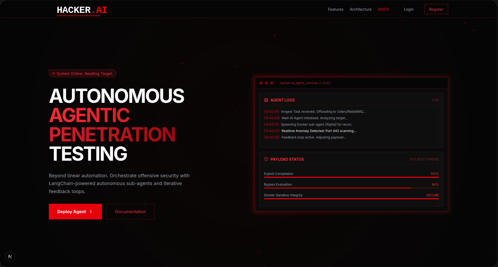
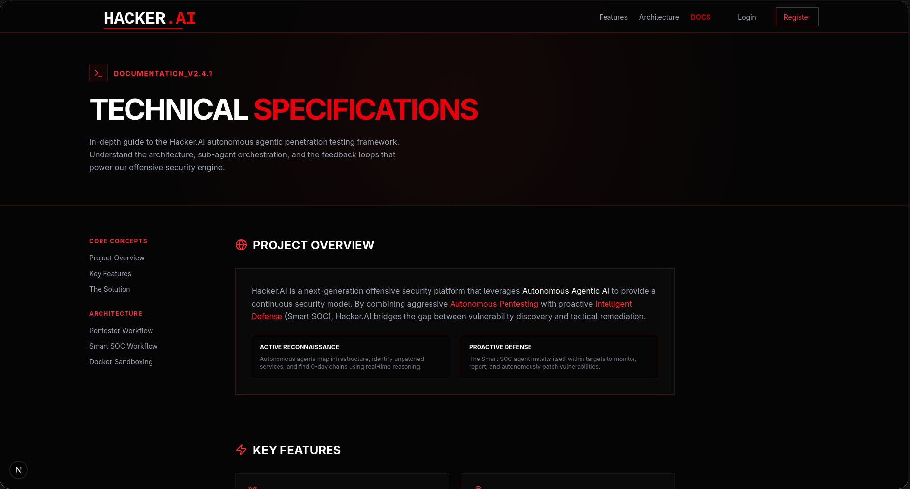
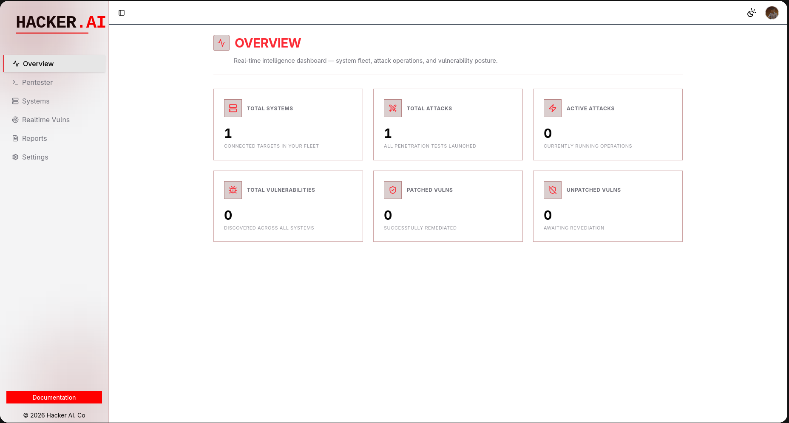
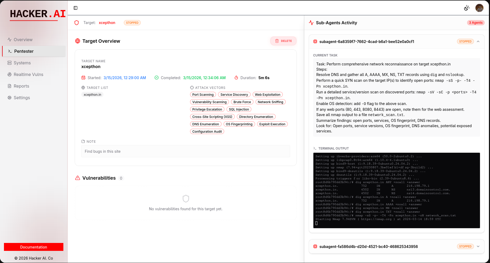

<div align="center">

# 🛡️ Hacker.AI

### Autonomous Agentic Penetration Testing & Intelligent Defense Platform

[](https://nextjs.org/)
[](https://python.org/)
[](https://langchain-ai.github.io/langgraph/)
[](https://docker.com/)
[](LICENSE)

**Hacker.AI** is a next-generation cybersecurity platform that combines **Autonomous AI Pentesting** with **Proactive Intelligent Defense (Smart SOC)** to deliver a continuous security model — from vulnerability discovery to autonomous remediation.



</div>

---

## 📋 Table of Contents

- [Overview](#-overview)
- [Key Features](#-key-features)
- [Architecture](#-architecture)
- [Tech Stack](#-tech-stack)
- [Project Structure](#-project-structure)
- [Dashboard](#-dashboard)
- [AI Pentester Pipeline](#-ai-pentester-pipeline)
- [Smart SOC Work.0 low](#-smart-soc-workflow)
- [Docker Sandboxing](#-docker-sandboxing)
- [Database Schema](#-database-schema)
- [Getting Started](#-getting-started)
- [Environment Variables](#-environment-variables)
- [Scripts](#-scripts)

---

## 🔍 Overview

Traditional security scanners follow rigid, rule-based scripts that miss 0-day chains and complex business logic vulnerabilities. **Hacker.AI** replaces this with LLM-powered autonomous agents that reason through environments, adapt tactics in real-time, and escalate privileges through creative chain-of-thought processing.

The platform operates on two fronts:

| Mode | Purpose |
|------|---------|
| **AI Pentester** | Offensive — autonomous vulnerability discovery and exploitation |
| **Smart SOC** | Defensive — continuous monitoring and autonomous patching |



---

## ⚡ Key Features

| Feature | Description |
|---------|-------------|
| **AI Pentester** | Autonomous Main Agent that orchestrates offensive strategies, selects tools (Nmap, Metasploit, SQLMap), and spawns isolated sub-agents |
| **Smart SOC** | Self-installing defense agent that deploys via SSH, performs periodic scans, and autonomously patches vulnerabilities |
| **Contextual Awareness** | Agents leverage company-specific context (infrastructure, tech stack) for strategic decision-making |
| **Docker Sandboxing** | Every sub-agent runs in an ephemeral Docker container with dynamic tool provisioning |
| **Async Orchestration** | Celery + RabbitMQ for massive parallelization of offensive and defensive tasks |
| **Real-time Terminal** | Live xterm.js terminal streaming sub-agent activity directly to the dashboard |
| **Automated Reporting** | AI-generated vulnerability reports with severity classification and remediation guidance |

---

## 🏗 Architecture

```
┌─────────────────────────────────────────────────────────────────┐
│                        FRONTEND (Next.js 16)                     │
│  Landing Page ─── Auth ─── Dashboard ─── Docs                    │
│       │               │         │                                │
│       │          Better Auth    ├── Overview                     │
│       │                         ├── Pentester (Attack UI)        │
│       │                         ├── Systems (SSH Management)     │
│       │                         ├── Reports (AI-Generated)       │
│       │                         └── Context (Company Intel)      │
└────────────┬──────────────────────┬─────────────────────────────┘
             │     tRPC + React Query                              
             │                      │                              
┌────────────▼──────────────────────▼─────────────────────────────┐
│                      API LAYER (tRPC Routers)                    │
│  pentester.ts ── overview.ts ── reports.ts ── systems.ts         │
└────────────┬──────────────────────┬─────────────────────────────┘
             │                      │                              
     ┌───────▼───────┐    ┌────────▼────────┐                     
     │   Inngest      │    │   PostgreSQL    │                     
     │  (Event Fn)    │    │  (Drizzle ORM)  │                     
     └───────┬────────┘    └─────────────────┘                     
             │                                                     
     ┌───────▼────────┐                                            
     │   RabbitMQ      │                                           
     │   (Message Q)   │                                           
     └───────┬────────┘                                            
             │                                                     
┌────────────▼────────────────────────────────────────────────────┐
│                   BACKEND (Python / Celery Workers)              │
│                                                                  │
│  ┌──────────────┐    ┌───────────────┐    ┌──────────────────┐  │
│  │ Main Agent   │───▶│  Sub-Agents    │───▶│ Docker Containers│  │
│  │ (LangGraph)  │    │  (LangGraph)   │    │ (Ephemeral)      │  │
│  └──────────────┘    └───────────────┘    └──────────────────┘  │
│         │                                                        │
│  ┌──────▼───────┐    ┌───────────────┐                          │
│  │ SSH Controller│    │Context Manager│                          │
│  │ (Paramiko)   │    │(LLM Trimming) │                          │
│  └──────────────┘    └───────────────┘                          │
└─────────────────────────────────────────────────────────────────┘
```

---

## 🛠 Tech Stack

### Frontend
| Technology | Purpose |
|-----------|---------|
| **Next.js 16** | App Router, React 19, Server Components |
| **tRPC v11** | End-to-end typesafe APIs |
| **React Query** | Server state management and caching |
| **Tailwind CSS v4** | Styling with custom red hacker theme |
| **Framer Motion** | Animations and transitions |
| **Radix UI + shadcn/ui** | Accessible component primitives |
| **xterm.js** | Real-time terminal rendering |
| **Better Auth** | Authentication (email/password) |
| **Inngest** | Serverless event-driven workflows |

### Backend
| Technology | Purpose |
|-----------|---------|
| **Python 3.13** | Core runtime |
| **LangGraph + LangChain** | Agentic AI framework (ReAct agents) |
| **Celery** | Distributed task queue for agent execution |
| **RabbitMQ** | Message broker for task distribution |
| **Docker SDK** | Container lifecycle management |
| **Paramiko** | SSH connections for Smart SOC deployment |
| **Pyte** | Terminal emulation and ANSI parsing |

### Infrastructure
| Technology | Purpose |
|-----------|---------|
| **PostgreSQL** | Primary database |
| **Drizzle ORM** | Type-safe schema management and migrations |
| **Upstash Redis** | Caching and real-time flags (force-stop) |
| **Docker** | Sandboxed execution environments |

---

## 📁 Project Structure

```
Hacker-AI/
├── app/                          # Next.js App Router
│   ├── (auth)/                   # Login & Register pages
│   ├── api/                      # API routes (tRPC, auth, inngest)
│   ├── dashboard/                # Main dashboard
│   │   ├── _components/
│   │   │   ├── sections/
│   │   │   │   ├── overview.tsx      # System overview cards
│   │   │   │   ├── pentester.tsx     # Attack creation & monitoring
│   │   │   │   ├── systems.tsx       # SSH system management
│   │   │   │   ├── reports.tsx       # AI-generated reports
│   │   │   │   ├── context.tsx       # Company context input
│   │   │   │   └── settings.tsx      # User settings
│   │   │   ├── sidebar.tsx           # Navigation sidebar
│   │   │   └── section-header.tsx    # Reusable section header
│   │   └── pentester/            # Live pentester terminal view
│   ├── docs/                     # Technical documentation page
│   └── page.tsx                  # Landing page
│
├── backend/                      # Python AI Engine
│   ├── main.py                   # Celery worker & AI orchestrator
│   ├── agent.py                  # Main Agent (LangGraph ReAct)
│   ├── sub_agent.py              # Sub-Agent with Docker tools
│   ├── docker_controller.py      # Docker container management
│   ├── ssh_controller.py         # SSH session management
│   ├── context_manager.py        # LLM context trimming
│   ├── prompts.py                # System prompts for agents
│   ├── db_manager.py             # Database operations
│   └── logger.py                 # Structured logging
│
├── trpc/                         # tRPC API Layer
│   ├── routers/
│   │   ├── pentester.ts          # Attack CRUD & control
│   │   ├── overview.ts           # Dashboard statistics
│   │   ├── reports.ts            # Report generation & management
│   │   └── systems.ts            # System CRUD
│   ├── init.ts                   # Router initialization
│   └── server.ts                 # Server context
│
├── db/                           # Database Layer
│   ├── schema.ts                 # Drizzle schema definitions
│   ├── relations.ts              # Table relationships
│   └── index.ts                  # DB client export
│
├── inngest/                      # Event-Driven Workflows
│   ├── client.ts                 # Inngest client
│   └── functions.ts              # Attack & Report workflows
│
├── toolkit/                      # Smart SOC Toolkit
│   ├── install.sh                # Systemd service installer
│   └── main.py                   # Monitoring agent script
│
├── components/                   # Shared UI Components
│   ├── hero.tsx                  # Landing page hero
│   ├── navbar.tsx                # Navigation bar
│   ├── features.tsx              # Features showcase
│   └── ui/                       # shadcn/ui primitives
│
└── lib/                          # Shared Utilities
    ├── auth.ts                   # Better Auth server config
    ├── auth-client.ts            # Auth client helpers
    ├── rabbitmq.ts               # RabbitMQ publisher
    ├── redis.ts                  # Redis client
    └── utils.ts                  # General utilities
```

---

## 📊 Dashboard

The dashboard is the central control center, organized into focused sections:



| Section | Description |
|---------|-------------|
| **Overview** | At-a-glance stats — total attacks, active scans, systems monitored, vulnerabilities found |
| **Pentester** | Create attacks by specifying targets, attack vectors, and custom notes. Monitor live sub-agent terminals |
| **Systems** | Register and manage servers via SSH credentials for Smart SOC deployment |
| **Reports** | Generate AI-powered security reports from completed attacks or system scans |
| **Context** | Provide company-specific intelligence (tech stack, infrastructure, policies) to enhance agent decision-making |
| **Settings** | Profile management and account configuration |



---

## 🗡 AI Pentester Pipeline

The offensive pipeline follows a four-stage execution model:

```
┌──────────────┐    ┌───────────────┐    ┌──────────────┐    ┌────────────────┐
│  1. Objective │───▶│ 2. Tactical   │───▶│ 3. Docker    │───▶│ 4. Exploitation│
│   Ingestion   │    │   Reasoning   │    │   Swarming   │    │     Loop       │
│               │    │               │    │              │    │                │
│ Inngest event │    │ LLM analyzes  │    │ Spawn ephm.  │    │ Feedback from  │
│ → RabbitMQ    │    │ target + ctx  │    │ containers   │    │ sub-agents →   │
│ → Celery      │    │ → strategy    │    │ per tool     │    │ pivot/escalate │
└──────────────┘    └───────────────┘    └──────────────┘    └────────────────┘
```

**Main Agent Tools**: `create_subagent`, `send_message`, `check_subagent_status`, `get_subagent_findings`, `list_subagents`, `stop_subagent`, `finalize_report`, `wait`

**Sub-Agent Tools**: `execute_command`, `read_terminal`, `wait_for_output`, `send_keys`, `check_messages`, `mark_step_completed`, `report_finding`, `report_to_main`

---

## 🛡 Smart SOC Workflow

The defensive pipeline provides continuous autonomous protection:

```
SSH Discovery → Agent Deployment → Continuous Auditing → Dashboard Reporting → Autonomous Patching
```


1. **SSH Discovery & Deployment** — Agent connects via Paramiko, installs the monitoring subsystem as a `systemd` service
2. **Continuous Auditing** — Periodic scans of the local system, kernel, and active services
3. **Dashboard Reporting** — Vulnerabilities reported in real-time with severity and impact analysis
4. **Autonomous Patching** — User clicks "Fix Now" → agent executes targeted remediation scripts

---

## �️ Eliminating False Positives

Hacker.AI moves beyond "vulnerability detection" to **"vulnerability verification"**. We solve the industry-wide problem of false positive fatigue through three core pillars:

### 1. Proof-of-Exploitation (Offensive)
Standard scanners flag version banners. Hacker.AI agents flag **outcomes**. The AI Pentester doesn't report a vulnerability until a sub-agent verifies it through a safe exploitation loop or proof-of-concept. If an exploit doesn't trigger, the risk is downgraded.

### 2. Direct Introspection (Defensive)
The Smart SOC agent runs locally on your servers. It doesn't guess based on network packets; it audits real-time process states, configuration files on disk, and kernel-level vulnerabilities. This eliminates 99% of network-artifact noise.

### 3. Contextual Reasoning
By utilizing the **Context Dashboard**, the AI understands your environment. It won't flag deliberate "internal-only" shortcuts or "test-bench" configurations if you've marked them as intentional, allowing your team to focus on real external threats.

---

## �🐳 Docker Sandboxing

Every sub-agent operates in complete isolation:

- **Ephemeral Lifecycle** — Containers are created per-task and destroyed on completion
- **Dynamic Tool Provisioning** — Tools are installed inside containers only when the attack vector requires them
- **Network Segregation** — Isolated virtual networks prevent unauthorized lateral movement
- **Resource Quotas** — CGroup limits on CPU/RAM protect host stability

---

## 🗄 Database Schema

| Table | Purpose |
|-------|---------|
| `user` | User accounts with email verification |
| `session` / `account` | Better Auth session and OAuth management |
| `attack` | Pentesting engagements with targets, vectors, status, and final report |
| `attack_vm` | Individual sub-agent containers with task, terminal buffer, and findings |
| `system` | Registered servers with SSH credentials for Smart SOC |
| `vulnerability` | Discovered vulnerabilities linked to systems, with fix status tracking |
| `report` | Generated security reports linked to users |

---

## 🚀 Getting Started

### Prerequisites

- **Node.js** 20+ / **Bun** 1.0+
- **Python** 3.13+
- **Docker** (running daemon)
- **PostgreSQL** database
- **RabbitMQ** instance
- **Redis** instance (Upstash recommended)

### Frontend Setup

```bash
# Install dependencies
bun install

# Push database schema
bun run db:push

# Start development server
bun run dev
```

### Backend Setup

```bash
cd backend

# Install Python dependencies (using uv)
uv sync

# Start the Celery worker
celery -A main worker --loglevel=info
```

### Inngest Dev Server

```bash
bun run inngest
```

---

## 🔐 Environment Variables

Create a `.env` file in the project root:

```env
# Database
DATABASE_URL=postgresql://...

# Authentication
BETTER_AUTH_SECRET=your-secret-key

# Message Queue
RABBITMQ_URL=amqp://...

# Cache / Real-time
REDIS_URL=redis://...
UPSTASH_REDIS_REST_URL=https://...
UPSTASH_REDIS_REST_TOKEN=...

# AI Models
GROQ_API_KEY=your-groq-key

# Inngest
INNGEST_EVENT_KEY=your-event-key
```

---

## 📜 Scripts

| Command | Description |
|---------|-------------|
| `bun run dev` | Start Next.js dev server |
| `bun run build` | Production build |
| `bun run db:generate` | Generate Drizzle migrations |
| `bun run db:push` | Push schema to database |
| `bun run db:studio` | Open Drizzle Studio GUI |
| `bun run inngest` | Start Inngest dev server |

---

<div align="center">

**Built by the Hacker.AI Team**

</div>
